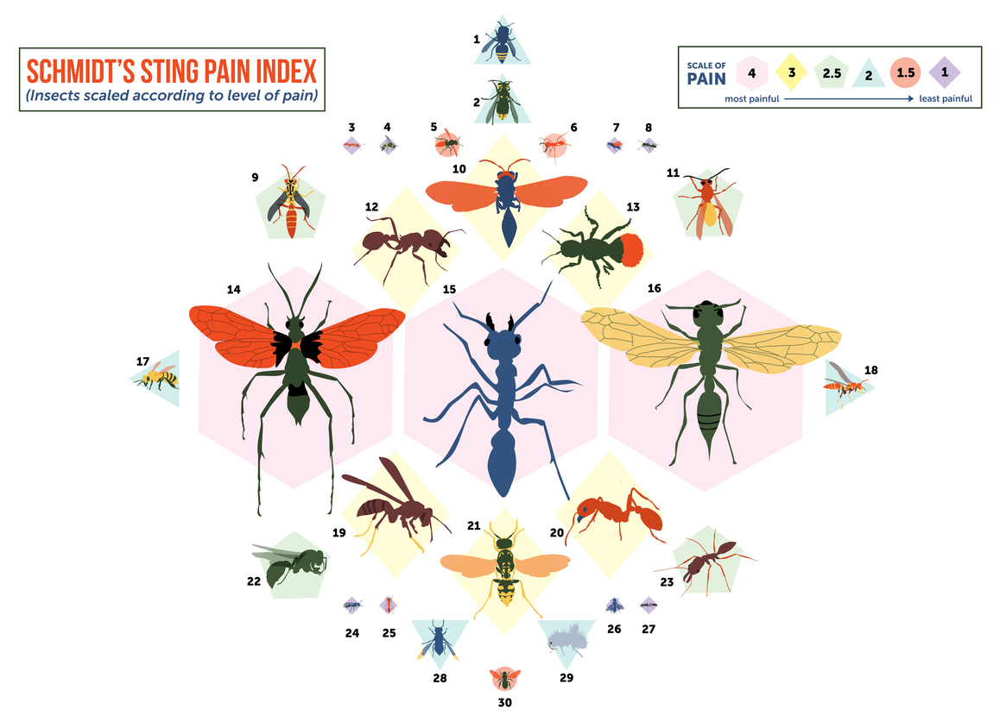

> EXAM || PGR6301 - Web Development and API Design || ID 365
# Schmidts Stinging Friends

Welcome to 'Schmidts Stinging Friends', a Gacha-game based on *The Schmidt Pain Index*.

In this game you will collect cards of with varying Pain Levels, ranging from the nettleish 1 to the torturous 4. The cards come in Lootboxes that you can purchase with the in-game currency called cash.

New users start out with a cash balance of $1000 and are also gifted 3 complimentary Lootboxes. If you happen to have multiple cards of the same type, you are able to Mill these cards when viewing your collection.

Be aware - there are insects flying and crawling around, so you might get stung!

Happy collecting!

## Project description:
The solution is based on material learned during the course PGR6301 - Web Development and API Design.

The project is based on a Node.js back end and a React front end.
The focus of the project is to have a secure and authenticated web server, where I use Express.js together with Passport.js to serve the React-based front end using a RESTful API. It does not use a dedicated database as the course did not include this, so it rather uses a in-memory database.

Using the solution is pretty straight forward, where you can view all the cards in the game while unauthenticated, or you can sign up to get access to your own personal collection of cards, as well as lootboxes and cash to purchase lootboxes.
A user can chose to mill the cards in his collection for a predetermined value. With the newly acquired cash the user can purchase more lootboxes in the hopes of collection all the 30 cards available.

Every 60 seconds a logged in user gets notified over a WebSocket that it has been stung by an insect, and that it has received a complimentary gift in the form of a new lootbox.

Users can also chat with each other in the WebSocket based chat at the bottom of the page.

I have chosen to hash the users passwords. This is done with MD5 because BCrypt has dependencies that I can not guarantee is installed on the examiners computer. The hash is therefore not considered secure, but it is still better than saving passwords in plain text.

As for requirements I've completed every requirement - R1 to R5, T1 to T6 and I have > 76% test coverage.

Use the command "yarn start" to start the server and navigate to http://localhost:8080 to test it for yourself.

### Technologies used
RESTful API, HTTP, WebSockets, Yarn, React, Node.js, Express.js, Passport.js, Babel, WebPack, Enzyme, Jest, Supertest, MD5

### Extra features:
* Hashing of user passwords
* WebSocket based chat that broadcasts new messages to all logged in users

### Other notes

## External sources:
From https://github.com/arcuri82/web_development_and_api_design:
* tests/jest-setup.js
* tests/mytest-utils.js
* tests/mytest-utils-ws.js
* webpack.config.js
* .gitignore

Hashing taken from https://dev.to/nedsoft/a-simple-password-hash-implementation-3hcg

'Schmidts Pain Scale' data taken from:
https://www.atlasobscura.com/articles/the-colorful-pain-index-of-the-stinging-ants-bees-and-wasps-around-the-world

